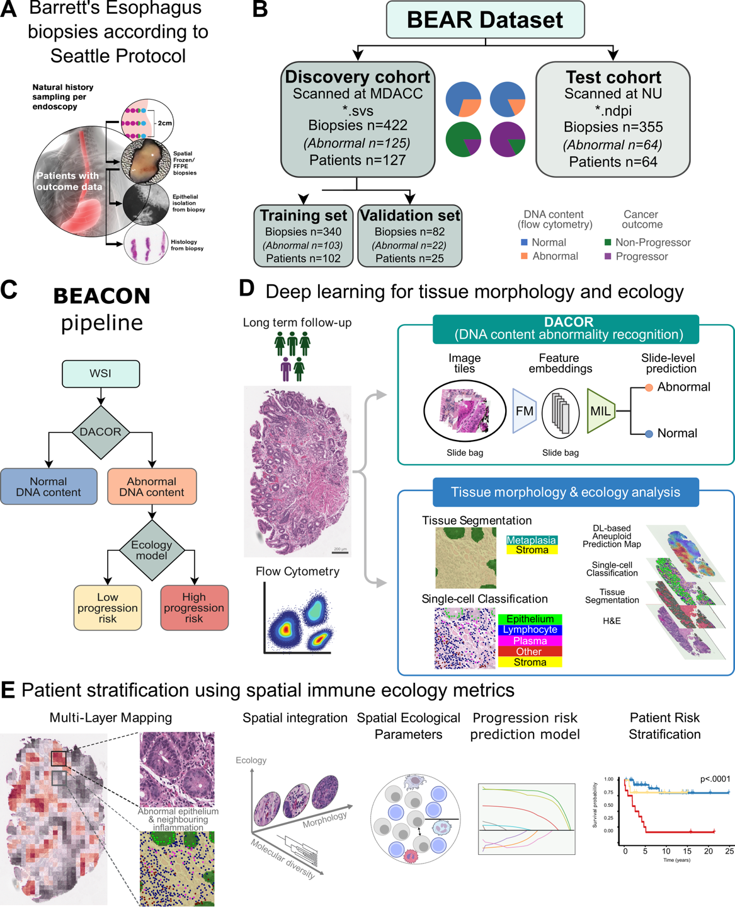

# BEACON: Histopathology-based Spatial Profiling of Immune and Molecular Features Predicts Cancer Risk in Barrett's Esophagus

**Authors:** Caner Ercan, Xiaoxi Pan, Thomas G. Paulson, Matthew D. Stachler, Fahire Göknur Akarca, William M. Grady, Carlo C. Maley, Yinyin Yuan

**Preprint:** [](https://doi.org/10.1101/2025.11.11.25339952)
**Model weights & manual annotations:** [](https://doi.org/10.5281/zenodo.17583572)

---

## Overview

BEACON (**B**arrett **E**sophagus DNA content **A**bnormality and immune E**c**ology for **O**utcome) is a spatially aware framework that predicts DNA content abnormalities and characterizes immune spatial ecology from routine histopathology images, to stratify Barrett's esophagus patients by cancer progression risk.

Key components:
- **DACOR**: a multi-instance learning model predicting DNA content abnormality (aneuploidy) from H&E whole-slide images.
- **Spatial immune ecology**: cell segmentation, cell classification, and tissue segmentation models feeding a suite of spatial statistics (density, Ripley's L, Moran's I, Getis-Ord-Gi*, Morisita-Horn, kNN distance, G-function) that characterize the immune landscape relative to epithelial structures.
- **Risk stratification**: a LASSO model integrating DNA content abnormality and immune spatial ecology to predict cancer progression risk.



## Contents

- [Overview](#overview)
- [Repository structure](#repository-structure)
- [Installation](#installation)
- [Container images](#container-images)
- [Workflow](#workflow)
  - [Inference](#inference)
  - [Fine-tuning](#fine-tuning)
- [Data availability](#data-availability)
- [Using the released models](#using-the-released-models)
- [Citation](#citation)
- [License](#license)

## Repository structure

```
.
├── 1.aneuploid/
│   ├── mil/                     DACOR: MIL model training and inference (CLAM-based)
│   └── benchmark/               DACOR vs. prior nuclear-feature aneuploidy methods
├── 2.intermediate/
│   ├── 2.1.cell/                nucleus segmentation + cell classification (CellViT-plus-plus)
│   └── 2.2.segmentation/        tissue component segmentation (SegFormer)
├── 3.integration/
│   ├── ecology/                 spatial ecology metric computation
│   ├── risk_model/              the LASSO risk-stratification model (+ an Elastic Net comparison)
│   └── sensitivity/             parameter-sensitivity analysis for the spatial statistics
├── 4.plotting/
│   ├── figures/                 main-text and supplementary figure generation
│   ├── clinical/                clinical covariate tables and Cox models
│   ├── incremental_value/       incremental value of BEACON over clinical factors
│   └── unit_of_analysis/        slide- vs. patient-level statistical analysis
├── requirements.txt             Python dependencies
└── README.md                    this file
```

The step numbered 2.3 in the workflow below (integration and export in QuPath) is a manual,
GUI-driven step and therefore has no directory here.

Several analysis folders carry their own `README.md` with deeper detail — the exact settings that
reproduce a specific published number, per-script run order, and known caveats:
[`1.aneuploid/benchmark/`](1.aneuploid/benchmark/README.md),
[`3.integration/risk_model/`](3.integration/risk_model/README.md),
[`3.integration/sensitivity/`](3.integration/sensitivity/README.md),
[`4.plotting/clinical/`](4.plotting/clinical/README.md), and
[`4.plotting/unit_of_analysis/`](4.plotting/unit_of_analysis/README.md).

## Installation

1. Clone the repository:
   ```bash
   git clone https://github.com/caner-ercan/BEACON.git
   cd BEACON
   ```

2. Install Python dependencies (or use the container images below):
   ```bash
   pip install -r requirements.txt
   ```

3. Set the environment variables the scripts expect. Nearly every script resolves its input and
   output locations from `BE_MASTER`; the DACOR feature extractor additionally needs
   `FOUNDATION_MODEL_ROOT`. Neither has a default — scripts fail immediately with a clear message
   if they are unset, rather than guessing a path.
   ```bash
   export BE_MASTER=/path/to/BE_master
   export FOUNDATION_MODEL_ROOT=/path/to/foundationModels
   ```

`BE_MASTER` points at the data root (whole-slide images, intermediate tables, model checkpoints,
outputs). `FOUNDATION_MODEL_ROOT` points at the directory holding the REMEDIS base model
downloaded from PhysioNet plus the locally fine-tuned checkpoints.

R scripts (`2.intermediate/`, `3.integration/`, `4.plotting/`) list their package dependencies at
the top of each file.

## Container images

Prebuilt images on Docker Hub, one per part of the pipeline:

| Image | Used for | Dockerfile |
|---|---|---|
| `cercan/cellvit:latest` | nucleus segmentation and cell classification | [`2.intermediate/2.1.cell/CellViT-plus-plus/Dockerfile`](2.intermediate/2.1.cell/CellViT-plus-plus/Dockerfile) |
| `cercan/segformer:latest` | tissue segmentation | — |
| `cercan/tf:212gpu` | SimCLR fine-tuning of the REMEDIS feature extractor | [`1.aneuploid/mil/finetuning/Dockerfile`](1.aneuploid/mil/finetuning/Dockerfile) |
| `cercan/rstudio:433` | R analyses: spatial ecology, risk model, plotting | [`3.integration/ecology/Dockerfile`](3.integration/ecology/Dockerfile) |

DACOR is not containerised — install its dependencies from [`requirements.txt`](requirements.txt).

```bash
docker run --gpus all -it -v /path/to/BE_master:/data -e BE_MASTER=/data cercan/rstudio:433
```

## Workflow

Two distinct things live in this repository, with different entry points:

- **[Inference](#inference)** — running the already-trained pipeline on whole-slide images to
  produce aneuploidy predictions, spatial ecology metrics, and a risk call. This is what most
  users want, and it needs the released checkpoints from Zenodo.
- **[Fine-tuning](#fine-tuning)** — training each model from scratch on annotated data, which is
  how those released checkpoints were produced. Only needed to retrain on your own cohort.

### Inference

Requires the model weights from [Zenodo](https://doi.org/10.5281/zenodo.17583572).

```
1  DNA content abnormality (DACOR)  ─┐
                                     ├─→  3  spatial ecology  →  4  risk stratification
2  immune landscape                 ─┘
     2.1 cell predictions
     2.2 tissue segmentation
     2.3 integration & export (QuPath)
```

Steps 1 and 2 are independent and can run in parallel; step 3 consumes the output of both.

#### 1. DNA content abnormality (DACOR)

Predicts aneuploidy from H&E whole-slide images by multi-instance learning over REMEDIS tile
features. Scripts in [`1.aneuploid/mil/`](1.aneuploid/mil/).

1. **Tile the slides** — `create_patches_fp.py`
2. **Extract tile features** — `extract_features_fp.py`, then `mergeFeature_h5Files.py` to
   consolidate per-slide feature files.
3. **Predict** — `eval.py`, pointed at the released `s_16_checkpoint.pt`.
4. **Attention heatmaps** — `create_heatmaps.py`, `create_heatmaps_fromh5file.py`, and
   `inference_aggregate_create_heatmaps.py`. The per-tile attention scores produced here are an
   input to step 3.

#### 2. Immune landscape

**2.1 Cell predictions.** Nucleus instance segmentation and per-cell classification, both with
CellViT-plus-plus, in [`2.intermediate/2.1.cell/CellViT-plus-plus/`](2.intermediate/2.1.cell/CellViT-plus-plus/).
Run `cellvit/inference/inference_disk.py`, which handles tiling, stitching, and overlap
resolution across the whole slide. The classifier consumes the segmenter's cell embeddings, so
both released checkpoints are needed.

**2.2 Tissue segmentation.** Four-class tissue segmentation (background, columnar epithelium,
stroma, squamous epithelium) with SegFormer, in
[`2.intermediate/2.2.segmentation/`](2.intermediate/2.2.segmentation/). Run `code/wsi_inference.py`.

**2.3 Integration and export (QuPath).** A manual step in the QuPath GUI, not scripted here. The
per-cell detections from 2.1, the tissue masks from 2.2, and the per-tile DACOR attention scores
from step 1 are imported into a QuPath project and merged, so that every detected cell carries its
class, its tissue context, and its attention score. Measurements are then exported as per-slide
TSVs to `$BE_MASTER/2.intermediate/2.4.inference/`, which is where step 3 reads from.

#### 3. Spatial ecology metrics

Computes the spatial statistics describing the immune landscape. R Markdown in
[`3.integration/ecology/`](3.integration/ecology/), run in numeric order:

| Script | Produces |
|---|---|
| `1.1.cell_dist_241106.Rmd` | assembles per-cell tables from the exported TSVs |
| `1.2.cell_attn.Rmd` | joins DACOR attention scores onto cells |
| `2.1.clustering_ripley.Rmd` | Ripley's cross-L |
| `2.2.density.Rmd` | cell-type densities |
| `2.3.getis_ord_gi.rmd` | Getis-Ord Gi* hot-spot statistics |
| `2.4.knn.Rmd` | k-nearest-neighbour distances |
| `2.5.moran_241224.rmd` | Moran's I |
| `2.6.morisita.Rmd` | Morisita-Horn overlap |
| `2.7.nn_gfunction.Rmd` | nearest-neighbour G-function |
| `3.0.merge_normalize.Rmd` | merges and standardises all metrics into the final feature matrix |

The `.nb.html` files alongside are the rendered notebook outputs from the published run.

#### 4. Risk stratification

The LASSO model integrating DNA content abnormality with immune spatial ecology, in
[`3.integration/risk_model/`](3.integration/risk_model/) — see its
[`README.md`](3.integration/risk_model/README.md) for the settings that reproduce the published
fit. `00_config.R` holds paths and hyperparameters, `01_fit_en_vs_lasso.R` fits the model, and
`03_response_table.R` assembles the reported metrics. To apply the released model instead of
refitting, see [Using the released models](#using-the-released-models).

### Fine-tuning

How each released checkpoint was produced. Every stage expects `BE_MASTER` to point at a data root
laid out as described in [Installation](#installation).

#### REMEDIS feature extractor (SimCLR)

Self-supervised fine-tuning of the REMEDIS backbone on BEACON tiles, producing the feature
extractor DACOR runs on. Code in [`1.aneuploid/mil/finetuning/`](1.aneuploid/mil/finetuning/)
(`main_finetune.py`, settings in `config.py`); the notebook
[`notebooks/simclr/finetune_250207_albm_448_ds2.ipynb`](1.aneuploid/mil/notebooks/simclr/finetune_250207_albm_448_ds2.ipynb)
is the exact run used for the published model. Run in `cercan/tf:212gpu`. Needs
`FOUNDATION_MODEL_ROOT` set, and the REMEDIS base model downloaded from PhysioNet.

#### DACOR (MIL)

After extracting features with the fine-tuned backbone:

1. **Build the train/validation/test split** — `create_splits_seq.py`
2. **Train** — `main.py` (single fixed split, fixed hyperparameters)
3. **Evaluate** — `eval.py`

```bash
python 1.aneuploid/mil/main.py --split 16 --model_type clam_mb --model_size big --task task_1_tumor_vs_normal
```

#### CellViT nucleus segmentation

`cellvit/train_cellvit.py`, configured by
[`train_config.yaml`](2.intermediate/2.1.cell/CellViT-plus-plus/train_config.yaml) — Virchow
backbone, epithelial vs. other nuclei. Trained first, since the classifier below builds on it.

#### CellViT cell classifier

`cellvit/train_cell_classifier_head.py` — five classes (lymphocyte, plasma cell, other immune,
epithelial, stromal), trained on the cell embeddings from the nucleus segmenter.

See [`NOTICE.md`](2.intermediate/2.1.cell/CellViT-plus-plus/NOTICE.md) for the upstream commit
this is vendored from and the local modifications made for BEACON.

#### SegFormer tissue segmentation

In [`2.intermediate/2.2.segmentation/`](2.intermediate/2.2.segmentation/), two stages:

1. **Pre-train on public TCGA data** — `tcga_trainer/tcga_trainer.py`
2. **Fine-tune on BEACON annotations** — `code/main.py`, launched by `code/finetune.sh`
   (published setting: MiT-B0, lr 1e-4). For cluster execution, `code/submit_jobs.sh` with
   `code/k8_yamls/job_submit.yaml`.

## Data availability

Model weights and manual annotations are archived on Zenodo: **https://doi.org/10.5281/zenodo.17583572**

- **Models**: fine-tuned weights for DACOR, the CellViT nucleus segmentation and cell classification
  models, the tissue segmentation model, and the LASSO risk-stratification model.
- **Annotations**: the manual tissue segmentation, nucleus segmentation, and cell classification
  annotations these models were fine-tuned on — tile + label pairs, ready to use independently of
  this code repository.

The fine-tuned REMEDIS foundation model used as DACOR's feature extractor is not redistributed. The
base REMEDIS model (`path-152x2-remedis-m`) is available from PhysioNet
(https://physionet.org/content/medical-ai-research-foundation/1.0.0/) after registration and the
required data use agreement; the fine-tuning procedure is in `1.aneuploid/mil/finetuning/`.

## Using the released models

Minimal load examples — see each model's Zenodo README for the exact architecture settings and
the code path that produced it.

**DACOR** (PyTorch, CLAM):
```python
import torch
from models.model_clam import CLAM_MB  # 1.aneuploid/mil/models/model_clam.py

model = CLAM_MB(size_arg="big", n_classes=2, input_L=<remedis_feature_dim>)
model.load_state_dict(torch.load("s_16_checkpoint.pt", map_location="cpu"))
model.eval()

features = torch.load("slide_tile_features.pt")  # (n_tiles, remedis_feature_dim)
with torch.no_grad():
    logits, Y_prob, Y_hat, attention, _ = model(features)
print("Aneuploid probability:", Y_prob[0, 1].item())
```

**Tissue segmentation** (TensorFlow/Keras, SegFormer):
```python
from transformers import TFAutoModelForSemanticSegmentation

id2label = {0: "background", 1: "columnar", 2: "stroma", 3: "squamous"}
model = TFAutoModelForSemanticSegmentation.from_pretrained(
    "nvidia/mit-b0", num_labels=4, id2label=id2label,
    label2id={v: k for k, v in id2label.items()}, ignore_mismatched_sizes=True,
)
model.load_weights("finetuned_model.h5")
prediction = model(tile_batch).logits  # tile_batch: (batch, 1024, 1024, 3)
```

**CellViT nucleus segmenter / cell classifier** (PyTorch): the checkpoints are self-describing —
each bundles its own config, architecture name, and state dict:
```python
import torch
checkpoint = torch.load("cellvit_segmenter.pth", map_location="cpu")
checkpoint.keys()  # "config", "arch", "model_state_dict"
```
Nucleus segmentation on a whole slide needs the real tiling/stitching pipeline, not a bare forward
pass — run it via `2.intermediate/2.1.cell/CellViT-plus-plus/cellvit/inference/inference_disk.py`,
which loads the checkpoint this way internally.

**LASSO risk model** (R, glmnet):
```r
fit <- readRDS("fitted_model.rds")
params <- readRDS("model_parameters.rds")
prob <- predict(fit, newx = feature_matrix, s = params$lambda_1se, type = "response")
risk_call <- ifelse(prob > params$best_threshold, "High", "Low")
```

## Citation

If you use this code, please cite the preprint. If you use the model weights or manual annotations,
please also cite the Zenodo record. A machine-readable citation is in [`CITATION.cff`](CITATION.cff).

```bibtex
@article{Ercan2025,
  title = {Histopathology-based Spatial Profiling of Immune and Molecular Features Predicts Cancer risk in Barrett's Esophagus},
  author = {Ercan, Caner and Pan, Xiaoxi and Paulson, Thomas G. and Stachler, Matthew D. and Akarca, Fahire Göknur and Grady, William M. and Maley, Carlo C. and Yuan, Yinyin},
  journal = {medRxiv},
  year = {2025},
  doi = {10.1101/2025.11.11.25339952},
  url = {https://www.medrxiv.org/content/early/2025/11/13/2025.11.11.25339952}
}

@misc{Ercan2025Zenodo,
  title = {BEACON: model weights and manual annotations},
  author = {Ercan, Caner and Pan, Xiaoxi and Paulson, Thomas G. and Stachler, Matthew D. and Akarca, Fahire Göknur and Grady, William M. and Maley, Carlo C. and Yuan, Yinyin},
  year = {2025},
  publisher = {Zenodo},
  doi = {10.5281/zenodo.17583572},
  url = {https://doi.org/10.5281/zenodo.17583572}
}
```

## License

GNU General Public License v3.0 — see [`LICENSE`](LICENSE).
